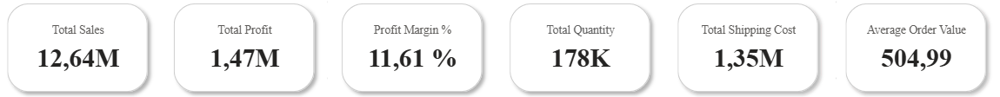
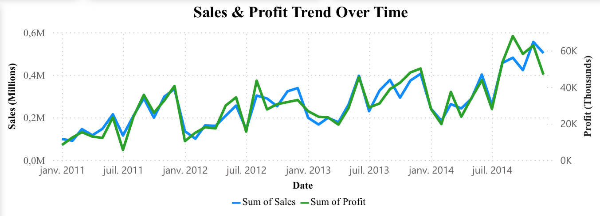
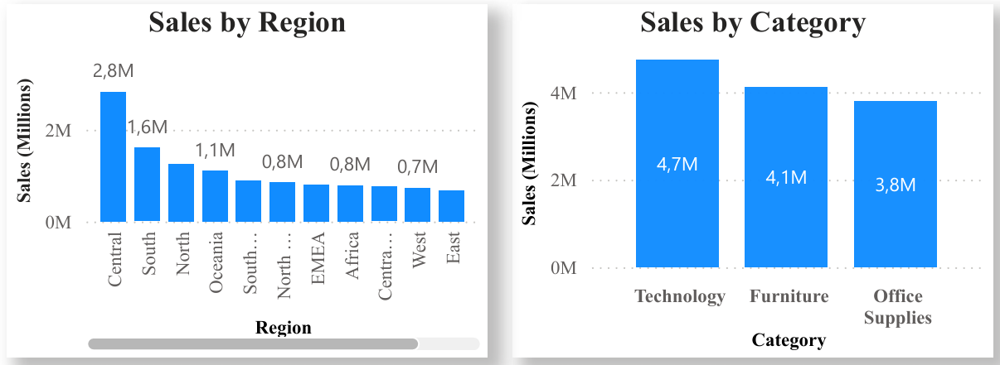
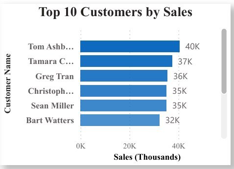

# 📊 Global Sales & Profit Dashboard – Power BI

## 📌 Overview 
This project showcases an **interactive Power BI dashboard** analyzing global retail sales between 2011 and 2014.  
It provides business insights through KPIs, sales trends, category & regional analysis, and customer performance.  

## 📊 Dataset
The dashboard was built using the **Sample Superstore Dataset**, a publicly available dataset widely used for learning BI and analytics.  

- **Rows:** 51.3k  
- **Columns:** 24  
- **Time Period:** 2011–2014  
- **Main Fields:**  
  - `Order Date` – Date of order  
  - `Ship Date` – Date shipped  
  - `Sales` – Sales amount  
  - `Profit` – Profit amount  
  - `Quantity` – Units sold  
  - `Discount` – Discount applied  
  - `Shipping Cost` – Delivery costs  
  - `Customer Name` – Customer identifier  
  - `Category`, `Sub-Category` – Product classification  
  - `Region`, `Country` – Geographical info  
  - `Segment` – Customer segment (Consumer, Corporate, Home Office)  

📥 The dataset can be downloaded from: (https://www.kaggle.com/datasets/apoorvaappz/global-super-store-dataset).

## 🔑 Key Features
- **KPI Cards:** Total Sales, Total Profit, Profit Margin %, Quantity, Shipping Cost, Average Order Value.  
- **Visuals:**  
  - Sales & Profit Trend Over Time (line chart).  
  - Sales by Category, Segment, and Region.  
  - Sales by Country (map).  
  - Top 10 Customers by Sales (horizontal bar chart).  
- **Interactivity:** Date, Region, Country filters.  
- **Custom Measures (DAX):** Profit Margin %, Average Order Value.  

## 🛠 Tools & Skills
- Power BI Desktop  
- Power Query (data cleaning & transformation)  
- DAX (Data Analysis Expressions)  
- Data Visualization & Dashboard Design  

## 📸 Dashboard Preview
- **KPI Cards**
  

- **Sales Trend**
  

- **Category & Region Insights**
  

- **Top 10 Customers**
- 
  

## 📂 Files
- `orders.pbix` → Power BI file
- `dashboard.pdf` → exported dashboard  
- `screenshots/` → dashboard screenshots  
- `dataset/` → dataset

## ✨ Insights
- Sales grew steadily with seasonal peaks.  
- Technology category drives the highest revenue.  
- Central region is most profitable.  
- Top 10 customers contribute a large share of sales.  
- Profit margin is ~12%.

---
👩‍💻 Created by *Hajar Lhamyani* – Data Scientist & Analyst | Machine Learning Engineer
